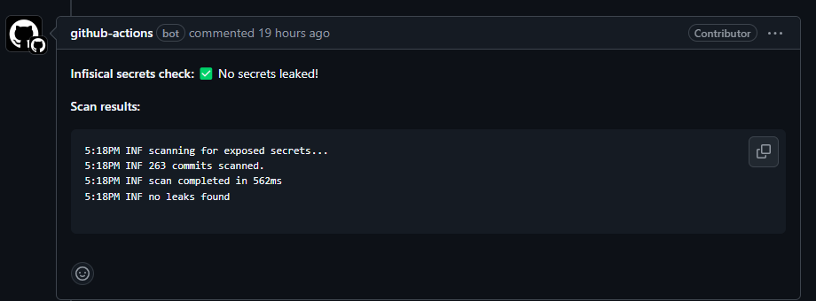
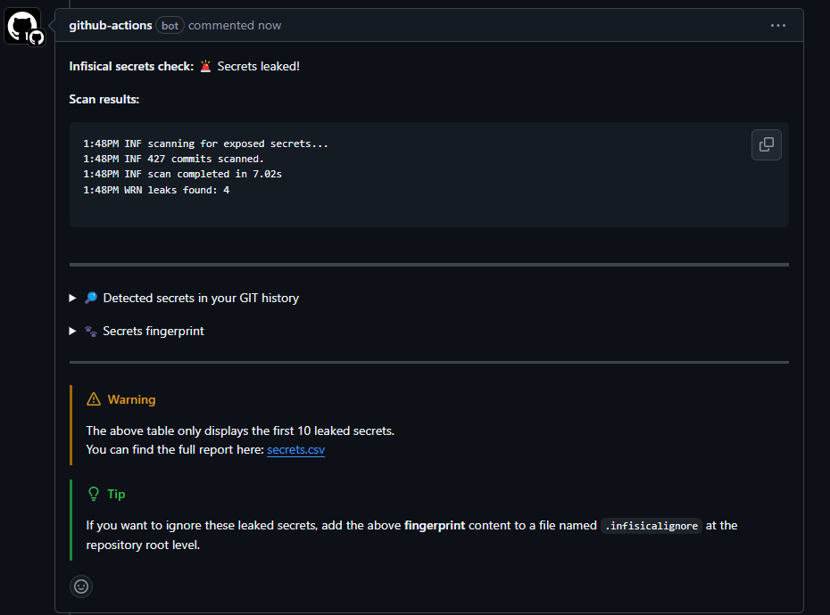

# GitHub Infisical secrets check Action

[](https://github.com/guibranco/github-infisical-secrets-check-action "shields.io")
[](https://github.com/guibranco/github-infisical-secrets-check-action "shields.io")
[](https://github.com/guibranco/github-infisical-secrets-check-action "shields.io")


[](https://wakatime.com/badge/github/guibranco/github-infisical-secrets-check-action)

🚨 :octocat: A GitHub action to check and report secret leaks in the repository using [Infisical CLI](https://infisical.com/docs/cli/commands/scan).

---

## Usage

The following workflow step will scan for secret leaks in your repository.

```yml
- name: Infisical Secrets Check
  id: secrets-scan
  uses: guibranco/github-infisical-secrets-check-action@v5.2.0
````

---

## Inputs

| Input         | Description                                    | Required | Default               |
| ------------- | ---------------------------------------------- | -------- | --------------------- |
| `GH_TOKEN`    | GitHub token to add comments in pull requests  | No       | `${{ github.TOKEN }}` |
| `ADD_COMMENT` | Whether to comment results in the pull request | No       | `true`                |

---

## Outputs

| Output           | Description                                                  |
| ---------------- | ------------------------------------------------------------ |
| `secrets-leaked` | The number of secrets leaked found by the Infisical CLI tool |

---

## Examples

### Basic usage with default settings

```yml
name: Infisical secrets check

on:
  workflow_dispatch:
  pull_request:

jobs:
  secrets-check:
    runs-on: ubuntu-latest
    permissions:
      contents: read
      pull-requests: write
    steps:
      - name: Infisical Secrets Check
        uses: guibranco/github-infisical-secrets-check-action@v5.2.0
```

---

### With a custom GitHub token

```yml
name: Infisical secrets check

on:
  workflow_dispatch:
  pull_request:

jobs:
  secrets-check:
    runs-on: ubuntu-latest
    permissions:
      contents: read
      pull-requests: write
    steps:
      - name: Infisical Secrets Check
        uses: guibranco/github-infisical-secrets-check-action@v5.2.0
        with:
          GH_TOKEN: ${{ secrets.CUSTOM_GH_TOKEN }}
```

Remember to add the repository secret `CUSTOM_GH_TOKEN`.

---

### Disable PR comments

```yml
name: Infisical secrets check

on:
  workflow_dispatch:
  pull_request:

jobs:
  secrets-check:
    runs-on: ubuntu-latest
    permissions:
      contents: read
      pull-requests: write
    steps:
      - name: Infisical Secrets Check
        uses: guibranco/github-infisical-secrets-check-action@v5.2.0
        with:
          ADD_COMMENT: false
```

---

### Using outputs in subsequent steps

```yml
name: Infisical secrets check

on:
  workflow_dispatch:
  pull_request:

jobs:
  secrets-check:
    runs-on: ubuntu-latest
    permissions:
      contents: read
      pull-requests: write
    steps:
      - name: Infisical Secrets Check
        id: secrets-scan
        uses: guibranco/github-infisical-secrets-check-action@v5.2.0
        
      - name: Handle secrets found
        if: steps.secrets-scan.outputs.secrets-leaked > 0
        run: |
          echo "Found ${{ steps.secrets-scan.outputs.secrets-leaked }} leaked secrets!"
          # Add your custom handling logic here
```

---

## Sample outputs

### Success - ✅ No secrets leaked



---

### Failure - 🚨 Secrets leaked!

Version 5 introduces an improved remediation workflow:

When secrets are detected, the action now:

* Shows detected fingerprints
* Generates `.infisicalignore` update suggestions
* Provides a **Commit suggestion button directly inside the PR comment**
* Automatically creates or updates `.infisicalignore`
* Prevents duplicate fingerprints

This allows contributors to fix false positives **without leaving the pull request UI**.



---

### Tool Failure - ⚠️ Unable to complete scan

When the Infisical CLI fails to run (due to network issues, API rate limiting, etc.), the action will post a clear error message:

* Explains that this is a tool failure, not a security issue
* Provides suggestions for resolution (re-run workflow, check logs)
* Includes a link to workflow logs for debugging
* Clarifies that the failure doesn't mean secrets were found

---

## Features

* 🔍 **Comprehensive scanning** using the latest Infisical CLI
* 💬 **Smart PR comments** with structured scan results
* 🧠 **Interactive remediation workflow (new in v5)** with commit suggestion support
* 📝 **Automatic `.infisicalignore` generation/update suggestions**
* 🧹 **Duplicate fingerprint prevention**
* 📊 **Detailed CSV and Markdown reports**
* 🔒 **Fork-safe execution**
* ⚡ **Efficient dependency caching**
* 🛡️ **Robust failure detection and reporting**
* 📎 **Workflow-friendly outputs**
* 🔧 **Configurable comment behavior**

---

## Error Handling

Version 4 introduced improved error handling that prevents confusing empty comments.

Version 5 builds on this by improving remediation guidance:

* Generates commit suggestions for ignore rules
* Prevents duplicate ignore entries
* Improces PR workflow ergonomics
* Keeps scan failures clearly separated from security failures

The action will fail the workflow appropriately, providing meaningful feedback on what went wrong and how to resolve it.

---

## Permissions

The action requires the following permissions:

```yml
permissions:
  contents: read
  pull-requests: write
```

---

## Ignoring False Positives

If the scan detects false positives:

Version 5 allows you to fix them directly from the PR comment.

The action now automatically:

1. Detects whether `.infisicalignore` exists
2. Creates the file if missing
3. Appends fingerprints if present
4. Removes duplicates automatically
5. Generates a **Commit suggestion button**

Simply click the suggestion button inside the PR comment to apply the ignore list instantly.

Manual fallback (still supported):

Create a `.infisicalignore` file at repository root:

```
fingerprint_value_here
another_fingerprint_here
```
