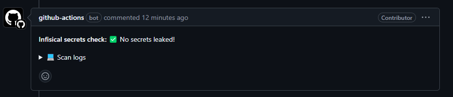
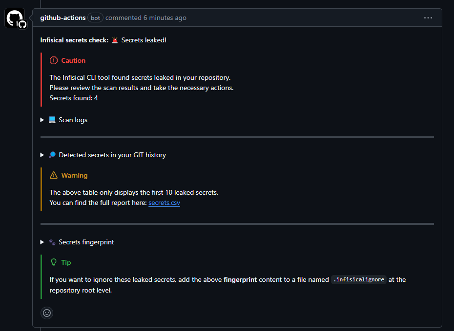

# GitHub Infisical secrets check Action

[](https://github.com/guibranco/github-infisical-secrets-check-action)
[](https://github.com/guibranco/github-infisical-secrets-check-action)
[](https://github.com/guibranco/github-infisical-secrets-check-action)


🚨 :octocat: A GitHub action to check and report secret leaks in the repository using [Infisical CLI](https://infisical.com/docs/cli/commands/scan).

---

## Usage

The following example workflow step will scan for secrets leak, add a comment to the pull request and output the quantity of secrets leaked.

```yml

  - name: Run the action
    uses: guibranco/github-infisical-secrets-check-action@latest
    id: secrets-scan
```

---

## Inputs

- `gh_token`: The GitHub token to add the comment in the PR using the [mshick/add-pr-comment@v2](https://github.com/mshick/add-pr-comment) GitHub Action.

---

## Outputs

- `secrets-leaked`: The number of secrets leaked found by the Infisical CLI tool.

---

## Example

### With default (inherited) GitHub token

```yml
name: 'Infisical secrets check'

on:
  pull_request:

  jobs:
    check-secrets:
      runs-on: ubuntu-latest
      permissions:
        contents: read
        pull-requests: write

      steps:
        - uses: actions/checkout@v4
          
        - name: Run the action
          uses: guibranco/github-infisical-secrets-check-action@latest
```

### With a custom GitHub token

```yml
name: 'Infisical secrets check'

on:
  pull_request:

  jobs:
    check-secrets:
      runs-on: ubuntu-latest
      permissions:
        contents: read
        pull-requests: write

      steps:
        - uses: actions/checkout@v4
          
        - name: Run the action
          uses: guibranco/github-infisical-secrets-check-action@latest
          with:
            gh_token: ${{ secrets.GH_TOKEN }}
```

Remember to add the repository secret `GH_TOKEN`.

---

## Sample output

### Success - ✅ No secrets leaked



### Failure - 🚨 Secrets leaked!


